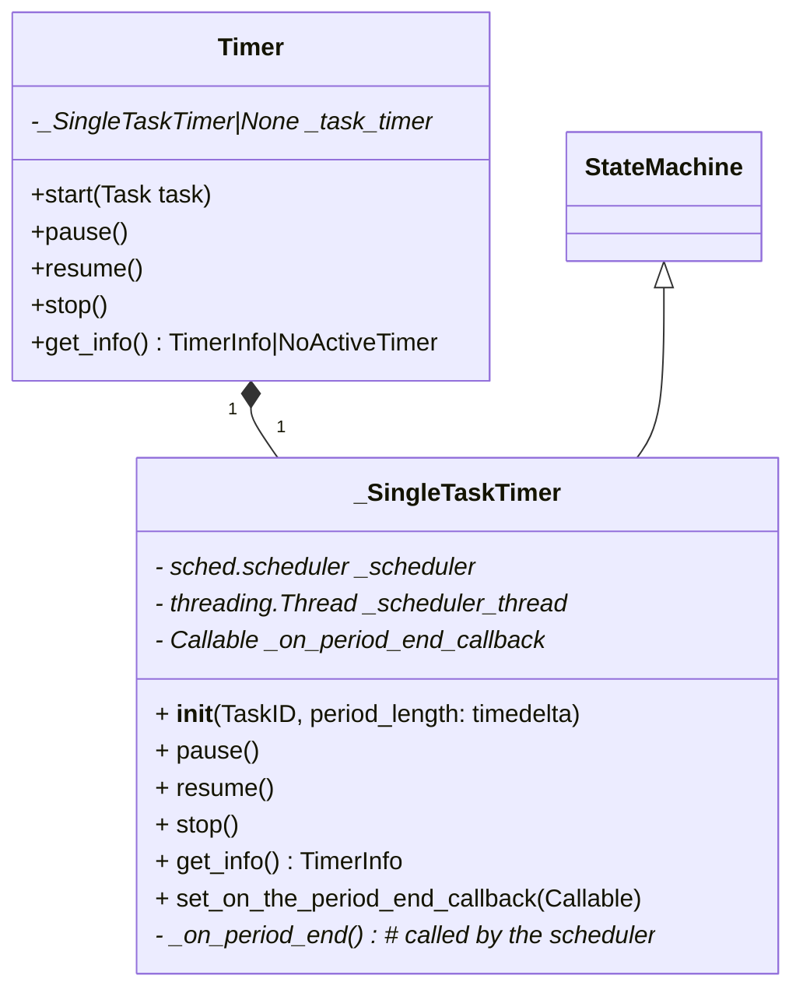

# Use Cases

I feel a bit stuck with the current state of the project.  Seems hard to work
with.

What are our main use cases so far?

## Regular workflow
- Start a timer on a task.
- Work while the timer is ticking.
- Stop working when the timer is done.
- A break is auto-started.  Go grab a coffee during the break.
- At the break's end the UI is switching back to the TaskList for selection of
  the next task.

## Pausing
- I should be able to pause the time -- e.g. if the period isn't done yet, but
  I have to look at something else, take a phone call, say.
- Afterwards I should be able to continue the same period.

Should be used only for smallish interruptions -- if I need to go do something
for an hour I probably should just stop the timer, and then start it again.

Currently each unbroken period creates a record in the TimeLog: if you pause
and continue once, that will create two records.

## Stopping
You can stop the period early.  That gets you into the TaskList for selection
of a task for the next period.

(Currently it also auto-starts a pause, but I plan to change that -- I pretty
much always stop that break immediately as well.)

That creates a record in TimeLog.

## (Not implemented) Switching the task

Sometimes I start doing one thing, and then I have to switch to another: e.g.
somebody pings me in the chat to do an urgent CL review. How do I handle such
cases?

I can stop the current period, start a new "Misc Work / Interrupts" period,
finish it in 10 minutes, and start another 25 minute "Real Project" period.

That breaks the usual work/break cadence though.

Alternatively I may want to switch to another task with the time left in the
current period.

### Refocusing

A special case of switching task: either to a tasks parent (widening focus)
or to a child (narrowing focus).  Useful when you started working on a small
feature, but then realized you also need to do a related refactoring, or a few.

From the user perspective that probably will look the same as switching to an
unrelated task.  (Or distantly related, if all the task are in the same task
tree.)

The time keeping can be implemented differently though.  When refocusing, the
whole period will get logged as the task it was refocused to.  With switching,
there will be two different periods logged.

### Implementation plan

Do two new commands:
- Switch to another task: stop the current work period, immediately start
  another with the time left from the current one.
- Replace task: change the current period to another task.  After replacing the
  application state is as if the current work period was for another task all
  along.

The "replace" doesn't take into account any task relationships: I'm not sure
how to implement that in a useful way.

# Architecture

The idea is to have an UI, where you can:
- select a task
- start the timer with it

There's also a whole different feature set for managing the tasks.

For the timer and the UI: the UI can be a few different things:
- It can be the current in-process TUI.
- Or it can be a GUI, Qt or Gnome or whatever, shouldn't change the architecture
  much.
- I also want to have a mobile app.
  - I can either use a server to take care of the timing, or I can have it be
    done locally, both on the mobile and on the desktop.

At on hand, I want to have the timer on the mobile app synchronized with timer
on the desktop.

On the other hand I want to be able to modify the tasks offline, and sync
afterwards.

Do I need to have the timer work in offline mode?

Yeah, why not.


## Timer

For the timer synchronization, I can have a server exporting the `Timer`
interface.  The UIs, both the TUI running on the laptop, and the mobile app, can
then poll the server to get the `TimerState`, and can call methods on `Timer` to
modify its state.

```python
class Timer:
  def start(task: Task, period_length: timedelta): ...
  def pause(): ...
  def resume(): ...
  def stop(): ...
  def get_info() -> TimerInfo | NoActiveTimer: ...


@dataclass(frozen=True)
class TimerInfo:
    """Information about the current Timer state."""
    state: TaskTimer.State
    task_id: TaskID
    period_length: timedelta
    elapsed_time: timedelta = timedelta(0)
```

### Remote / Server-Side Timer

I won't be able to call it 10 times a second though, I'll need to have a local
caching layer.

```python
# On the server
class Timer: 'see above'

# On the client
class RemoteTimer:
  def start(task: Task, period_length: timedelta | None): ...
  def pause(): ...
  def resume(): ...
  def stop(): ...
  # `get_info` will have to cache the info (period length / type / task / start
  # time), and calculate elapsed_time (time.now() - start_time).  It also should
  # poll the server every few seconds, and get notified by the server about
  # status changes (web socket, or over a tcp connection, or with a push
  # notification, etc).
  def get_info() -> TimerInfo | NoActiveTimer: ...
```

If the client gets disconnected, it can switch to an offline mode, and run a
local Timer.  Then, after reconnecting, it can try to reconcile its local time
with the server-side timer (cloud timer?)

### Refocusing / switching tasks

That will require a new method on Timer, something like:

```python
class Timer:
  ...
  def switch(new_task: Task):
    """Switch the rest of the current period to `new_task`.

    Stops the currently running task and immediately starts another period with
    `new_task`, with the rest of the current period as the new period length.

    There will be two timelog entries generated: one for the old task, one for
    the `new_task`.
    """

  def refocus(new_task: Task):
    """Change the current period `new_task`.

    The current task should be a direct ancestor or descendant of the
    `new_task`.

    There will be just one timelog record for the `new_task` generated.
    """
```

### Implementation: SingleTaskTimer

I started writing this after getting a bit frustrated and confused about the
best way to structure the Timer implementation.  What is called SingleTaskTimer
here started as the sole Timer implementation.  It was responsible for taking
track of actual time and creating records in the Timelog.  Then in the UI I
added a bunch of additional features: (1) Logic to have a break after a work
period (2) Logic to determine if it's time for a long break (3) Sending desktop
notifications on period ends (4) Bugging about timer not running (5) Creating
calendar events.

I realized though that it's not that important for the overall application: the
Timer interface is what the UIs are going to use, and I can restructure the
implementation beneath it at any time.



It probably makes sense to have in different places:

- The actual timer logic.  Like remembering the paused/running state, when a
  running timer was started, how much time already elapsed in a paused timer,
  how long is the current period.  It should have callbacks on
  pause/resume/stop/start.  It probably don't need to know anything about task
  ids, work/break periods.
- Another class may:
  - Store info about the task, (or break).
  - Have logic to decide how long the break should be.
  - Handle all the things that should happen on state change: logging to
    TimeLog, notifications, calendar integration.
- Notifications about timer not running may be factored out into yet another
  class.
